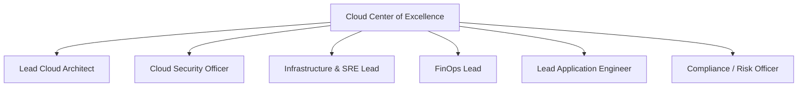

# The Cloud Center of Excellence (CCoE)

## Executive Summary

The Cloud Center of Excellence (CCoE) is a cross-functional leadership and advisory body responsible for establishing cloud standards, accelerating adoption, driving cloud governance, and fostering organizational maturity.

---

## 1. CCoE Charter and Composition

### Primary Responsibilities
1. **Architectural Guardrails**: Define enterprise cloud standards, approved services, and landing zone patterns.
2. **Policy as Code Governance**: Implement automated security and compliance guardrails in CI/CD pipelines.
3. **FinOps Stewardship**: Monitor enterprise cloud spend, drive reservation/savings plan strategies, and detect cost anomalies.
4. **Knowledge Dissemination**: Maintain the enterprise architecture handbook, conduct reference architecture reviews, and run architecture katas.

---

## 2. CCoE Anti-Patterns: How CCoEs Fail

| Anti-Pattern | Manifestation | Remedy |
| :--- | :--- | :--- |
| **The Ivory Tower** | CCoE produces 200-page PDF standards that no engineering team reads or follows. | Shift from Word documents to code: deliver pre-configured Terraform modules and automated linters. |
| **The Bureaucratic Bottleneck**| Every production deployment requires manual CCoE committee approval. | Automate approvals via automated policy validation (OPA Gatekeeper, AWS SCPs). |
| **The Vendor Puppet** | CCoE blindly approves whatever proprietary services cloud vendor sales reps recommend. | Ground all architectural decisions in empirical NFRs and objective trade-off analyses. |
| **The SRE Rebranding** | Renaming existing sysadmins to "CCoE" while they continue manually provisioning VMs via tickets. | Reorganize into a product-led Platform Engineering team building self-service APIs. |
