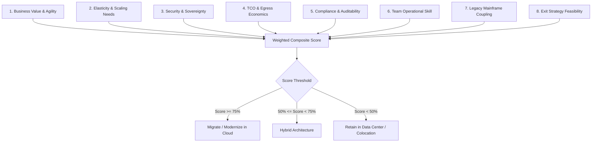

# Cloud Adoption Decision Framework

```yaml
status: approved
decision_type: framework
scope: enterprise-cloud-adoption
owners: architecture-review-board
review_cadence: semi-annual
```

## Executive Summary

This framework provides a measurable, quantitative scorecard to determine whether a workload should be migrated to the public cloud, retained on-premises, or deployed in a hybrid topology.

---

## 1. Quantitative Evaluation Dimensions

Every candidate workload is scored from **1 (Strongly Unfavorable)** to **5 (Strongly Favorable)** across 12 architectural criteria:



---

## 2. Measurable Scoring Scorecard

| Dimension | Weight | Criteria for Low Score (1-2) | Criteria for High Score (4-5) |
| :--- | :---: | :--- | :--- |
| **1. Business Agility** | 15% | Static, low-change back-office system; releases once a year. | High-velocity product requiring multiple daily deployments and rapid feature testing. |
| **2. Traffic Elasticity** | 15% | Completely flat 24/7 compute consumption; predictable throughput. | Highly spiky, viral, or seasonal traffic (e.g., Black Friday 10x surges). |
| **3. Latency Requirements**| 10% | Sub-millisecond hard real-time factory floor or HFT execution. | Standard web/API latency acceptable ($> 50 \text{ ms}$). |
| **4. Data Residency & Reg**| 10% | Strict national sovereignty laws requiring on-soil physical vaults. | Compliant with cloud provider certifications (SOC2, ISO27001, FedRAMP). |
| **5. Egress & Data Volume**| 10% | Petabytes of outbound network transfers to third parties. | Modest network egress; compute-heavy or internal-facing API workloads. |
| **6. System Interdependency**| 10%| Chatty RPC coupling to an on-premises mainframe (latency penalty). | Autonomous, decoupled service with minimal legacy back-channel ties. |
| **7. Software Licensing** | 10% | Punitive per-core proprietary licensing in virtualized/cloud environments.| Open-source or modern cloud-friendly BYOL licensing models. |
| **8. Team Capability** | 10% | Traditional sysadmin staff with zero IaC or cloud experience. | Mature engineering teams fluent in Terraform, Docker, and CI/CD automation. |
| **9. Hardware Dependencies**| 10%| Proprietary ASICs, serial cables, or unsupported legacy storage fabrics.| Standard x86 / ARM64 architectures compatible with cloud hypervisors. |

---

## 3. Decision Governance & Action Thresholds

- **Composite Score $\ge 75$**: **Public Cloud Target**. Formulate migration wave plan (Replatform or Refactor).
- **Composite Score $50 - 74$**: **Hybrid Cloud Target**. Deploy frontend/API tier in cloud; maintain data or core processing on-prem with Direct Connect/ExpressRoute.
- **Composite Score $< 50$**: **Retain / Repatriate**. Maintain workload on-premises or in colocation facility; re-evaluate annually.
