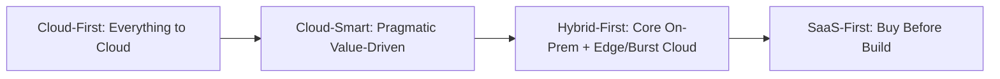

# Cloud Adoption Strategy: Postures and Trade-offs

## Executive Summary

Enterprises must select an explicit cloud adoption posture rather than blindly pursuing dogmatic "all-in" mandates. This document evaluates the four major enterprise adoption strategies.

---

## 1. The Four Cloud Adoption Postures



### Comparative Analysis

| Strategy Posture | Definition & Philosophy | Best Suited For | Major Architectural Risks |
| :--- | :--- | :--- | :--- |
| **Cloud-First** | Default assumption that all new applications and legacy systems must be deployed to public cloud unless granted a formal exception. | High-growth digital natives, greenfield organizations, rapid global scaling. | Massive cost overruns; moving unsuitable legacy mainframes/databases; cognitive overload. |
| **Cloud-Smart** | Workloads are evaluated based on business value, elasticity needs, total cost of ownership (TCO), and security constraints. Cloud is chosen when it delivers superior outcomes. | Fortune 500 enterprises, regulated BFSI and healthcare institutions. | Requires higher architectural maturity to evaluate trade-offs objectively; risk of analysis paralysis. |
| **Hybrid-First** | Core sensitive data and heavy baseline compute remain in corporate data centers; public cloud is used for burst capacity, external APIs, and AI/analytics. | Organizations with massive sunk capital in modern data centers, sovereign data constraints, ultra-low latency factories. | Network egress costs; complex hybrid networking and identity federation; operational split-brain. |
| **SaaS-First** | Prioritizing commercial off-the-shelf SaaS solutions (e.g., Salesforce, Workday, Datadog) before building custom software. | Non-differentiating business capabilities (HR, payroll, CRM, basic billing). | Vendor lock-in, data fragmentation across disparate SaaS silos, complex API integration layers. |

---

## 2. The Solution Architect's Recommendation

For 90% of large enterprise organizations, **Cloud-Smart** combined with **SaaS-First for non-core capabilities** represents the optimal balance. 

```text
Differentiating Core Domain (e.g., Custom Algorithmic Trading) ──> Custom Cloud-Smart Microservices
Supporting Domain (e.g., Invoicing / Order Processing)         ──> Modernized Cloud PaaS
Generic Domain (e.g., HR, Payroll, Corporate Email)            ──> Commercial SaaS
```
