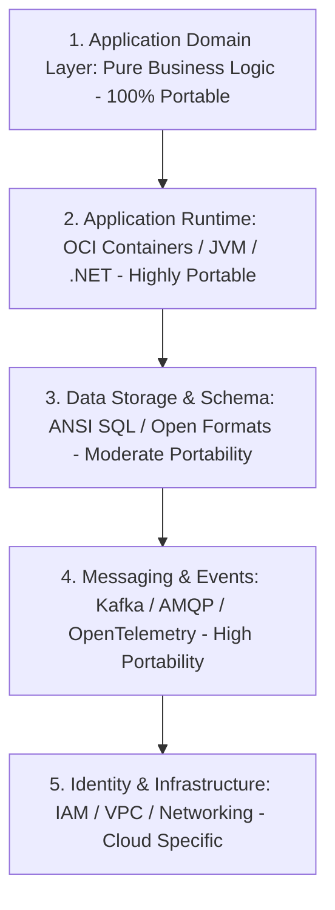

# Cloud Exit Strategy & Portability Architecture

## Executive Summary

A Cloud Exit Strategy is not an indication of vendor skepticism; it is a mandatory governance and regulatory requirement under enterprise risk management frameworks and European banking regulations (e.g., EBA Guidelines on Outsourcing, EU DORA regulation). An enterprise must be capable of migrating critical workloads away from a cloud provider in the event of insolvency, severe regulatory breach, or unsustainable price increases.

---

## 1. Architectural Layers of Portability

---

## 2. Portability Enablers vs Anti-Patterns

### Architectural Enablers (Do This)
- **Open Standards for Data**: Store analytical data in open table formats (Apache Iceberg, Parquet) rather than proprietary database silos.
- **Hexagonal / Clean Architecture**: Ensure application business logic communicates with cloud infrastructure (queues, blob storage) via abstract interfaces (ports) and cloud-specific adapters.
- **OCI Container Packaging**: Package all services as Open Container Initiative (OCI) compliant container images capable of executing on any CNCF-certified Kubernetes engine.
- **Declarative Infrastructure**: Author infrastructure in vendor-neutral declarative tooling (Terraform, OpenTofu) structured in modular layers.

### Portability Anti-Patterns (Avoid This)
- **Direct Cloud SDK Infiltration**: Importing `AmazonS3Client` or `BlobServiceClient` directly inside core domain entities or business services.
- **Proprietary Stored Procedures**: Embedding core business calculations in cloud-proprietary database engines without version-controlled application-tier alternatives.
- **Complex Multi-Cloud Abstraction Wrappers**: Building massive custom internal abstraction layers that dumb down every cloud provider to the lowest common denominator, destroying the value of cloud adoption.
