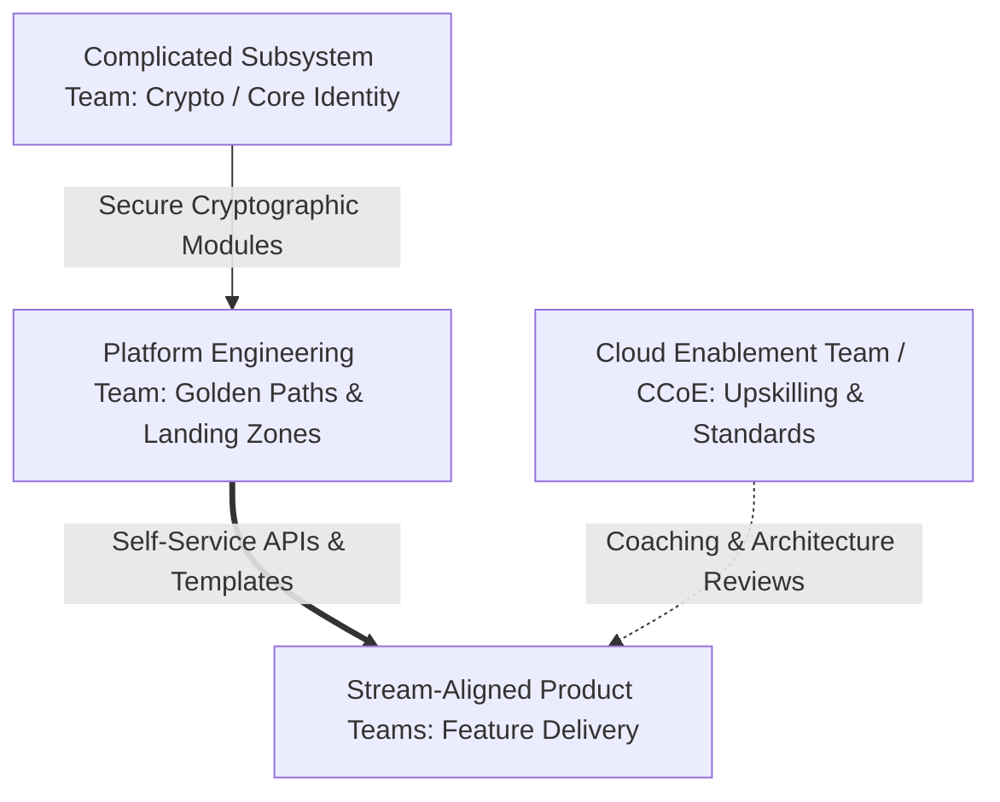

# Enterprise Cloud Operating Model Blueprint

## Executive Summary

The Cloud Operating Model defines the organizational structures, delivery processes, and governance mechanisms required to operate cloud infrastructure at enterprise scale.

---

## 1. Team Topologies for Cloud Architecture

### Team Responsibilities

1. **Stream-Aligned Teams (Product Engineering)**: Own end-to-end delivery of specific business capabilities. They consume platform services via self-service APIs and own the operational reliability of their applications (DevOps: "You build it, you run it").
2. **Platform Engineering Team**: Builds and maintains the **Internal Developer Platform (IDP)**. Provides automated landing zones, CI/CD pipelines, pre-hardened base images, and infrastructure templates. Success is measured by developer cycle time and NPS.
3. **Cloud Enablement Team (CCoE)**: Cross-functional advisory group defining architectural standards, compliance baselines, and running training dojos.
4. **Complicated Subsystem Teams**: Specialist teams owning esoteric infrastructure components (e.g., hardware security modules, high-frequency trading networking, bespoke cryptographic key engines).
