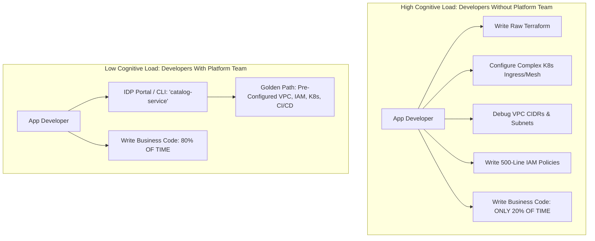

# Cloud Platform Teams and Internal Developer Platforms

## Executive Summary

Modern enterprise engineering organizations establish dedicated **Platform Teams** to reduce the cognitive load on application developers. The platform team builds an **Internal Developer Platform (IDP)** that encapsulates infrastructure complexity behind automated, self-service interfaces.

---

## 1. Cognitive Load Reduction

---

## 2. Platform as a Product Principles

1. **Self-Service by Default**: A developer must be able to spin up a fully compliant development environment or microservice skeleton in under 10 minutes without filing a ticket or waiting for human approval.
2. **Voluntary Adoption (No Mandates)**: Build a platform so superior, reliable, and convenient that engineering teams choose to adopt it voluntarily. If teams actively bypass the platform, treat it as a product defect.
3. **Paved Roads (Golden Paths)**: Provide frictionless paths for 80% of common workloads. Allow an escape hatch for the 20% of exceptional workloads (e.g., custom C++ kernels) with the understanding that they assume operational ownership.
