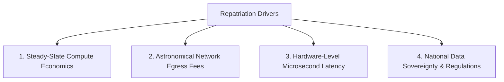

# Cloud Repatriation Strategy

## Executive Summary

Cloud repatriation—moving workloads from public cloud back to private data centers, colocation facilities, or bare-metal providers—is increasingly recognized as a valid architectural maneuver for mature, high-scale workloads with predictable resource consumption.

---

## 1. Economic & Architectural Drivers for Repatriation

### 1. Steady-State Compute Economics
Cloud elasticity provides massive financial value when demand fluctuates wildly. However, when a workload reaches a stable, predictable steady-state (e.g., 20,000 CPU cores running 24/7 at 85% utilization), renting that compute from a cloud provider at a 60–70% gross margin premium becomes economically inefficient compared to owned or leased hardware.

### 2. Network Egress and Data Gravity
Applications that generate petabytes of outbound network traffic (video delivery, IoT ingestion, continuous telemetry export) face punishing egress charges ($0.05 to $0.09 per GB) in hyperscale clouds. Moving processing nodes adjacent to owned fiber or unmetered transit reduces network spend by an order of magnitude.

---

## 2. Repatriation Feasibility Assessment Matrix

| Evaluation Dimension | High Repatriation Feasibility | Low Repatriation Feasibility (Keep in Cloud) |
| :--- | :--- | :--- |
| **Traffic Volatility** | Flat, predictable baseline 24/7/365 | Highly spiky, seasonal, unpredictable bursts |
| **Compute Packaging** | OCI Containerized (Docker, Kubernetes) | Deeply coupled to proprietary FaaS / Step Functions |
| **Database Layer** | Open-source SQL/NoSQL (PostgreSQL, Kafka, Cassandra)| Proprietary serverless DBs (DynamoDB, Spanner, BigQuery) |
| **Operational Staff** | In-house 24/7 hardware/networking operations capability| Lean software team with zero infrastructure sysadmins |
| **Capital Availability** | CapEx-friendly balance sheet for hardware purchases | Pure OpEx model preferred by financial leadership |

---

## 3. The Repatriation Execution Blueprint

1. **Decouple Cloud-Proprietary APIs**: Wrap all cloud-specific storage and messaging calls in domain interfaces.
2. **Establish Modern On-Prem Platform**: Deploy Kubernetes (OpenShift, Rancher, Talos) on leased bare-metal servers.
3. **Data Hydration**: Seed on-prem storage via physical transfer appliances (AWS Snowball, Azure Data Box) followed by continuous CDC replication.
4. **Traffic Cutover**: Shift DNS weights gradually (90/10 -> 50/50 -> 0/100) with real-time rollback capabilities.
