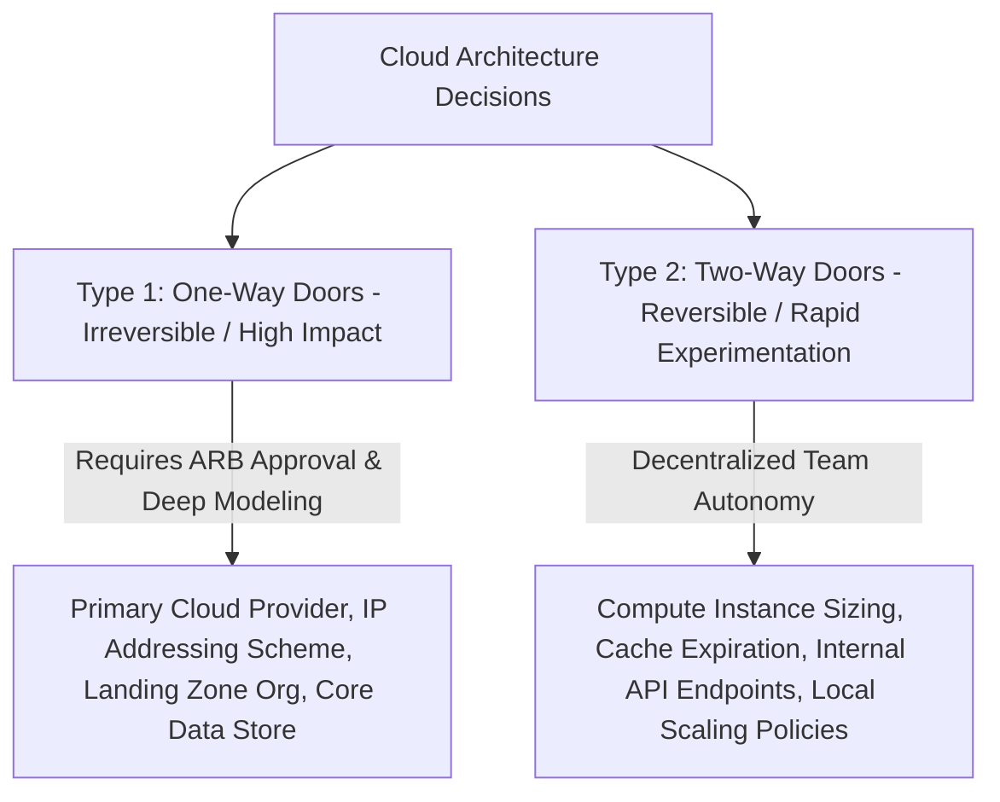

# Strategic vs Tactical Cloud Architecture Decisions

## Executive Summary

Architects make hundreds of decisions during cloud adoption. Bezos' taxonomy of **Type 1 (One-Way Door / Irreversible)** and **Type 2 (Two-Way Door / Reversible)** decisions provides a rigorous mental model for prioritizing governance and review effort.

---

## 1. One-Way Door vs Two-Way Door Decisions

### Decision Classification Matrix

| Decision Area | Type 1 (Strategic / One-Way Door) | Type 2 (Tactical / Two-Way Door) |
| :--- | :--- | :--- |
| **Cloud Provider Selection** | Choosing primary hyper-scaler (AWS vs Azure vs GCP) for next 5–10 years. | Selecting an alternate provider for a standalone edge ML experiment. |
| **Networking & IP Space** | Enterprise CIDR block allocation (`10.0.0.0/8`), Direct Connect routing topologies. | Adding a new subnet inside an existing VPC or adjusting security group egress rules. |
| **Data Architecture** | Choosing between relational ACID (PostgreSQL/Aurora) vs document NoSQL (MongoDB/Cosmos DB). | Adjusting index structures, table partitions, or read-replica connection pools. |
| **Identity & Landing Zone** | Root Organization hierarchy, master Entra ID tenant architecture, KMS root keys. | Adding a new developer IAM role or fine-tuning an RBAC role definition. |
| **Compute Platform** | Standardizing entire enterprise on Kubernetes vs Serverless FaaS. | Modifying pod resource requests, HPA CPU thresholds, or container base images. |
