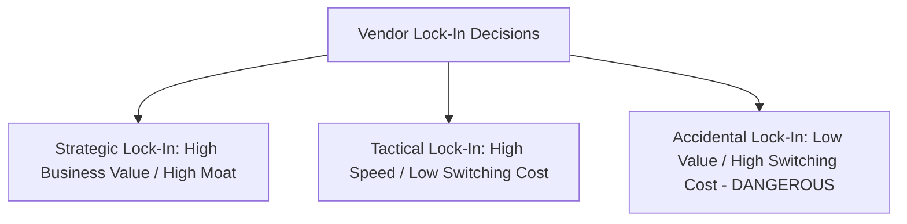

# Vendor Lock-In Governance: Strategic vs Tactical Lock-In

## Executive Summary

Vendor lock-in is widely feared but frequently misunderstood. In modern architecture, **some degree of vendor lock-in is necessary and advantageous**—without it, an organization cannot leverage managed services and is relegated to managing raw virtual machines. The goal of architecture governance is not to eliminate lock-in, but to make lock-in **conscious, strategic, and economically justified**.

---

## 1. Lock-In Classification Matrix

| Lock-In Category | Example Cloud Services | Business Justification | Exit Strategy |
| :--- | :--- | :--- | :--- |
| **Strategic Lock-In** (Accepted) | Google BigQuery, AWS DynamoDB, Snowflake | Delivers 10x query performance or single-digit millisecond latency at petabyte scale; saves millions in operational DBA salaries. | Maintain automated schema extractors and daily parquet data dumps to S3/GCS. |
| **Tactical Lock-In** (Accepted) | AWS SQS, Azure Service Bus, GCP Pub/Sub | Rapid time-to-market for simple async queues; zero operational overhead. | Abstract messaging via standard publisher/subscriber interfaces; switch to RabbitMQ/Kafka if needed. |
| **Accidental Lock-In** (Prohibited) | Embedding proprietary DynamoDB Document client calls directly across 200 UI controllers | None; pure developer laziness or lack of architecture standards. | Refactor code to enforce repository patterns and clean architecture boundaries. |

---

## 2. The Lock-In Cost-Benefit Formula

Before accepting proprietary cloud services, architects must evaluate:

$$\text{Net Value} = (\text{Development Velocity Gain} + \text{Operational Savings}) - (\text{Vendor Markup} + \text{Amortized Switching Cost})$$

If $\text{Net Value} > 0$, the architecture decision is economically sound. If the switching cost is catastrophic and operational savings are marginal, standard open-source equivalents must be chosen.
