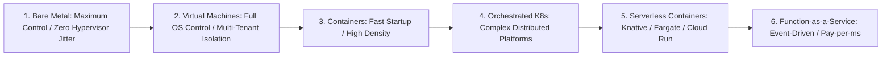

# Compute Architecture: Enterprise Runtimes & Selection

## Executive Summary

Compute architecture determines the physical or logical execution environment for application workloads. Architects must select compute platforms based on **runtime control**, **startup latency**, **scaling characteristics**, **statefulness**, and **Total Cost of Ownership (TCO)**—never technology fashion.

---

## Compute Abstraction Continuum

---

## Deliverables & Guides

| Document | Focus Area | Architectural Impact |
| :--- | :--- | :--- |
| **[Bare Metal vs VMs](bare-metal-vs-vms.md)** | Physical vs Hypervisor compute | NUMA nodes, SR-IOV, hypervisor jitter, when bare metal is required |
| **[VM Architecture](vm-architecture.md)** | Cloud Virtual Machine design | CPU oversubscription, placement groups, burstable vs dedicated |
| **[Container Runtimes](container-runtimes.md)** | Low-level execution runtimes | Docker, containerd, CRI-O, OCI standards, runc vs gVisor/Kata |
| **[Container Platforms](container-platforms.md)** | Container orchestration options | Raw Docker vs Managed PaaS vs CaaS vs Kubernetes |
| **[Serverless Compute](serverless-compute.md)** | Ephemeral event-driven compute | MicroVMs, execution lifecycles, concurrency limits, billing models |
| **[Managed App Platforms](managed-app-platforms.md)** | Cloud PaaS application runtimes | Heroku, Cloud Run, Azure App Service, Elastic Beanstalk |
| **[Compute Selection Framework](compute-selection-framework.md)** | Measurable decision framework | Multi-dimensional scoring across 11 architectural requirements |
