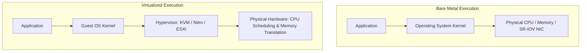

# Bare Metal vs Virtual Machines Architecture

## Executive Summary

While virtualization dominates modern enterprise infrastructure, certain high-performance and regulated workloads mandate bare-metal execution.

---

## 1. Architectural Comparison

| Dimension | Bare Metal Infrastructure | Cloud Virtual Machines |
| :--- | :--- | :--- |
| **Hypervisor Jitter** | Zero; direct access to hardware timers (TSC). | Microsecond-level scheduling jitter from vCPU context switching. |
| **Memory Access** | Direct access to local NUMA node memory buses. | Two-stage memory translation (EPT/NPT) creates minor TLB overhead. |
| **Network Performance** | Direct SR-IOV / RoCE (RDMA over Converged Ethernet) $> 100\text{ Gbps}$. | Software-defined networking overlay (Geneve/VXLAN) adds encapsulation. |
| **Provisioning Speed** | 10 to 30 minutes (firmware PXE boot). | 30 to 60 seconds via cloud hypervisor APIs. |
| **Scaling Flexibility** | Discrete, fixed physical chassis. | Elastic auto-scaling fleets; dynamic resizing. |

---

## 2. When Bare Metal is Mandatory

1. **Ultra-Low-Latency Financial Trading (HFT)**: Sub-microsecond tick-to-trade execution requires kernel bypass (Solarflare OpenOnload), dedicated CPU core pinning, and zero virtualization interrupts.
2. **Extreme Database Scaling (SAP HANA / Oracle Exadata)**: Workloads requiring $> 12\text{ TB}$ of unified RAM and millions of sustained IOPS.
3. **Nested Virtualization**: Running hypervisors inside hypervisors (e.g., Android emulators, custom security sandboxes).
