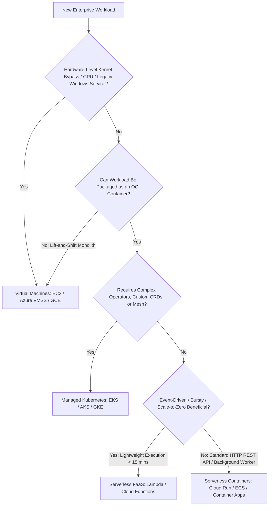

# Compute Selection Decision Framework

```yaml
status: approved
decision_type: framework
scope: enterprise-compute
owners: architecture-review-board
review_cadence: semi-annual
```

## Executive Summary

This framework provides an empirical decision tree and evaluation scorecard to determine the optimal compute runtime for any enterprise workload.

---

## 1. The Compute Decision Tree



---

## 2. Multi-Dimensional Decision Scorecard

| Evaluation Dimension | Virtual Machines (IaaS) | Containers / CaaS (Cloud Run / ECS) | Kubernetes (EKS / AKS / GKE) | Serverless FaaS (Lambda) |
| :--- | :---: | :---: | :---: | :---: |
| **Startup Latency** | $30 - 90 \text{ seconds}$ | $2 - 10 \text{ seconds}$ | Sub-second (on pre-warmed nodes) | $50\text{ ms} - 5\text{ s}$ (Cold start) |
| **Runtime Control** | Full (Root / Kernel / OS) | High (Container filesystem) | High (Pod specs / Capabilities) | Low (Vendor runtime sandbox) |
| **Scaling Velocity** | Minutes (VM provisioning) | Seconds | Seconds | Milliseconds |
| **Cost at Zero Traffic**| High (Paying for idle VM) | Zero (Scale to zero) | High (Paying for worker nodes) | **Zero (100% Free at idle)** |
| **Cost at Hyper-Scale** | **Lowest per vCPU unit** | Moderate | Low (with Spot / Karpenter) | **High (FaaS markup expensive)** |
| **Operational Overhead**| High (OS patching / AMIs) | **Minimal (Fully managed)** | **Extreme (Upgrades / Ingress)**| Minimal (Zero server ops) |
| **Team Skill Requirement**| Traditional SysAdmin | Basic Docker knowledge | **Advanced K8s SRE expertise** | Functional programming |
