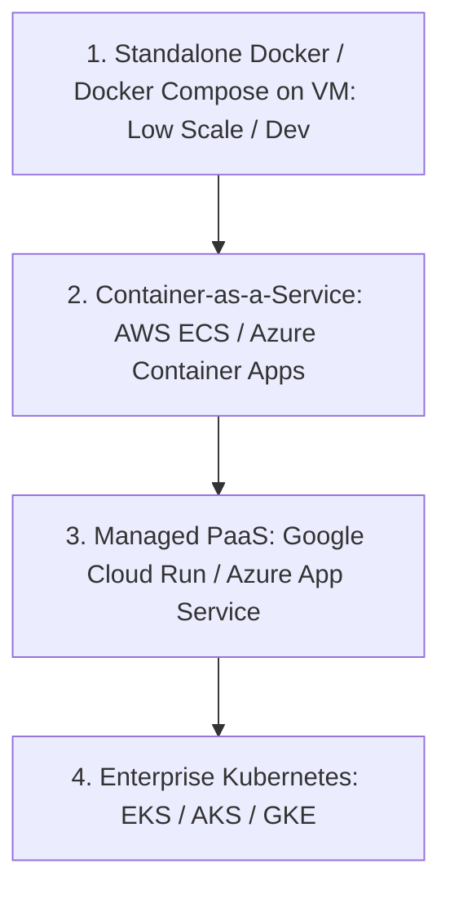

# Container Platforms: Standalone vs CaaS vs Kubernetes

## Executive Summary

Not every containerized application requires Kubernetes. Selecting a container platform requires matching operational complexity against scheduling sophistication.

---

## 1. Container Platform Hierarchy

### Comparative Analysis

| Platform Tier | Scheduling Capability | Operational Maintenance | When to Adopt |
| :--- | :--- | :--- | :--- |
| **Standalone Docker on VM** | Single-host only | High (Manual OS and Docker daemon patching) | Local development and single-server utility tools. |
| **Serverless PaaS (Cloud Run / App Service)**| Request-driven auto-scaling | Zero; provider manages runtime, scaling, and certificates | Standard web APIs, public websites, event consumers. |
| **Container-as-a-Service (ECS / Container Apps)**| Multi-container tasks, basic service discovery | Low; no control plane to manage; native cloud IAM | Microservices fleets not requiring custom operators. |
| **Kubernetes (EKS / AKS / GKE)**| Complex stateful orchestration, custom operators, mesh | High; complex upgrades, CRD lifecycles, network policies | Polyglot enterprise platforms, advanced traffic splitting. |
