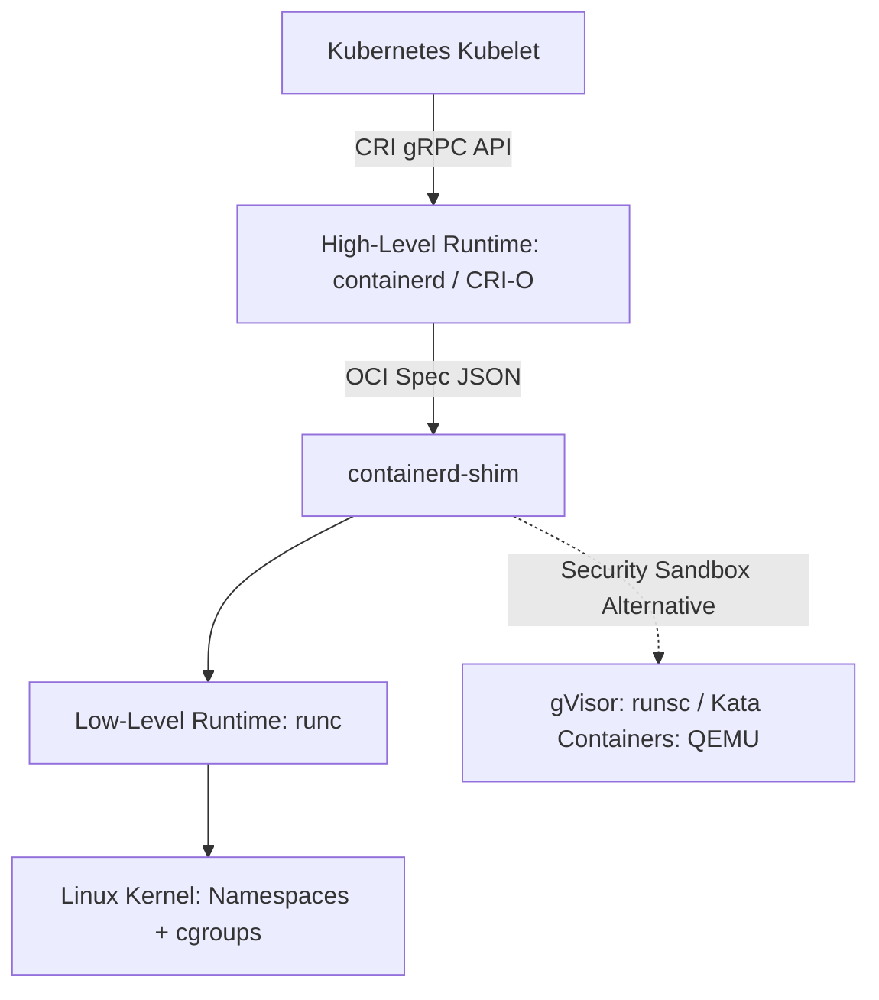

# Container Runtimes: containerd, CRI-O & Sandboxed Runtimes

## Executive Summary

The container ecosystem has evolved from monolithic Docker daemons into specialized, modular runtimes governed by the Open Container Initiative (OCI) and Kubernetes Container Runtime Interface (CRI).

---

## 1. Container Runtime Stack

---

## 2. Standard vs Sandboxed Container Runtimes

| Runtime Type | Implementation | Isolation Boundary | Target Workload |
| :--- | :--- | :--- | :--- |
| **Standard OCI (runc)** | `containerd`, `CRI-O` | Shared Linux kernel; isolation via namespaces and cgroups. | Trusted internal enterprise microservices. |
| **User-Space Kernel (gVisor)** | Google `runsc` | Intercepts all system calls in a user-space Sentry kernel; host kernel never exposed. | Multi-tenant SaaS running untrusted user code. |
| **MicroVM Sandbox (Kata)** | Kata Containers / QEMU | Spawns a dedicated lightweight hardware-isolated VM per pod. | High-security banking, regulatory boundary isolation. |
