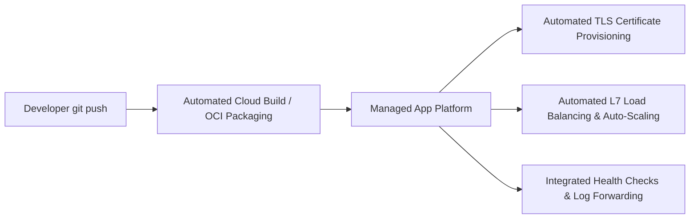

# Managed Application Platforms (Cloud PaaS)

## Executive Summary

Managed Application Platforms—such as **Google Cloud Run**, **Azure App Service**, and **AWS App Runner**—provide a "Golden Path" for software delivery, allowing engineering teams to deploy web apps directly from source code or container images without infrastructure provisioning.

---

## 1. Developer Workflow & Platform Responsibilities

---

## 2. Architectural Trade-Offs

- **Advantages**: Eliminates 90% of operational toil; built-in zero-downtime blue/green deployment slots; automated SSL renewal; integrated WAF.
- **Constraints**: Limited kernel-level networking customization; restricted port bindings (typically single HTTP/gRPC port exposed); fixed outbound IP pools requiring complex NAT gateway attachments for private database access.
