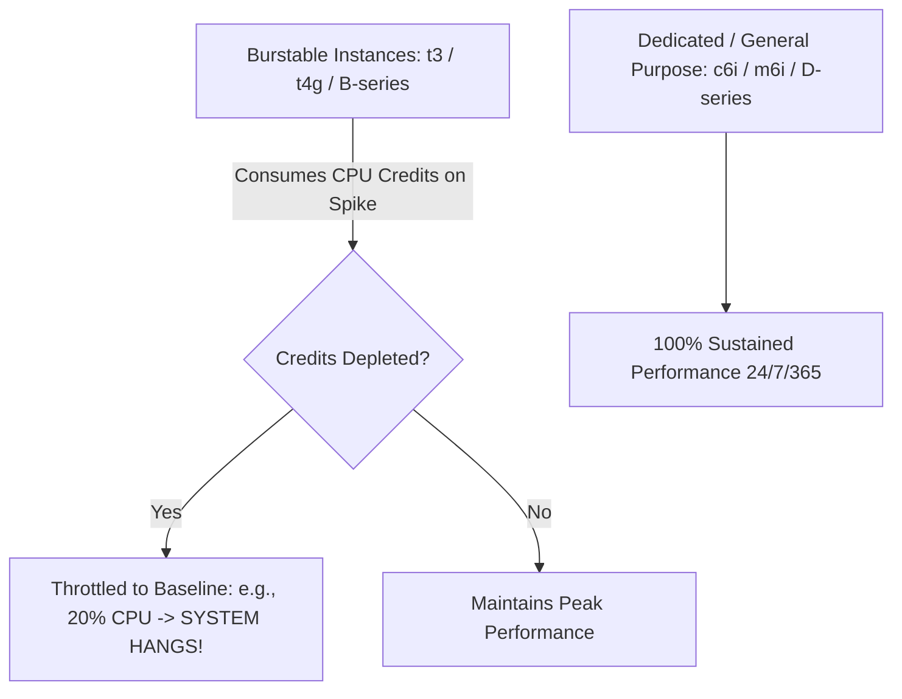

# Cloud Virtual Machine Architecture

## Executive Summary

Cloud Virtual Machines (VMs) provide dedicated operating system environments on top of shared physical hypervisors. Designing for virtual machines requires understanding **vCPU allocation**, **burstable CPU credits**, and **placement groups**.

---

## 1. vCPU Allocation & NUMA Topology

In modern cloud hypervisors (AWS Nitro, Azure Hyper-V, GCP KVM), 1 vCPU corresponds to one physical hardware hyper-thread:
- A VM with 8 vCPUs runs on 4 physical CPU cores.
- **NUMA (Non-Uniform Memory Access) Awareness**: When an application spans multiple NUMA nodes (typically $> 32\text{ vCPUs}$), memory access across the inter-socket interconnect (UPI/Infinity Fabric) incurs a $30\%$ latency penalty. High-performance databases must configure NUMA-aware memory allocation (`numactl`).

---

## 2. Burstable vs Dedicated Compute

> **Enterprise Rule: Prohibit Burstable Instances in Production**: Burstable instances (AWS `t3`, Azure `B-series`) are designed exclusively for development and staging environments. If an unexpected production surge exhausts CPU credits, the instance is throttled to baseline CPU, resulting in cascading request timeouts.
