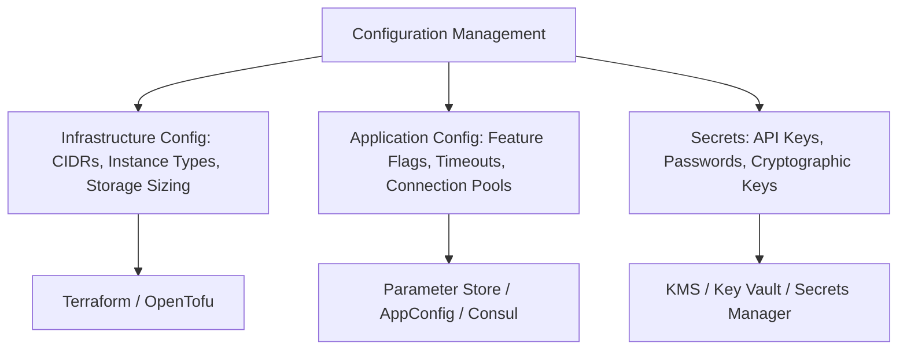

# Configuration Management Architecture

## Executive Summary

Configuration management separates software configuration from application source code and infrastructure definitions, enabling dynamic runtime adjustments without rebuilding containers or redeploying infrastructure.

---

## Configuration Hierarchy

---

## Deliverables & Guides

| Document | Focus Area | Architectural Impact |
| :--- | :--- | :--- |
| **[App vs Infra Config](app-vs-infra-config.md)** | Separation of concerns | Decoupling infrastructure provisioning from runtime application flags |
| **[Dynamic Configuration](dynamic-configuration.md)** | Runtime feature flags | Hot-reloading configurations, parameter stores, feature toggles |
| **[Configuration Drift](configuration-drift.md)** | Drift detection | Detecting and reconciling configuration drift across environments |
