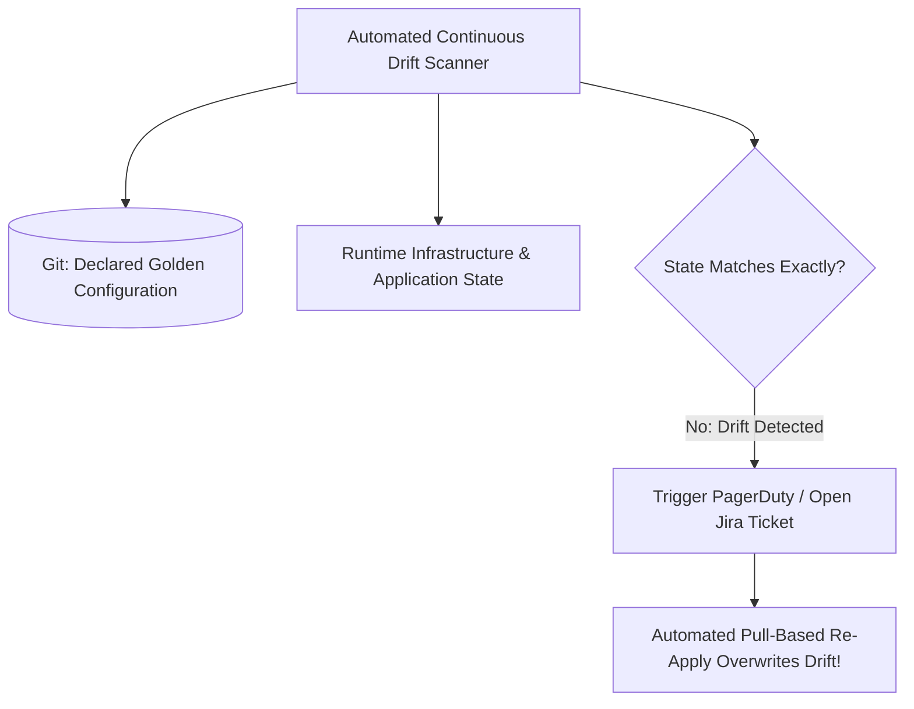

# Configuration Drift: Detection & Reconciliation

## Executive Summary

Configuration drift occurs when runtime environments gradually diverge from declared source code due to manual emergency hotfixes, automated agent patching, or transient script failures.

---

## 1. Automated Drift Reconciliation Loop

