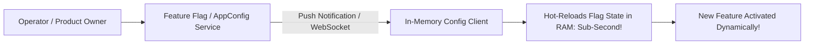

# Dynamic Runtime Configuration & Feature Toggles

## Executive Summary

Dynamic configuration allows updating application behavior in real time without restarting running processes or interrupting active user connections.

---

## 1. Hot-Reload Architecture

---

## 2. Guardrails for Dynamic Flags
- **Targeted Gradual Rollouts**: Deploy flags to 1% of users, evaluate error budgets, and automatically roll back if 5xx errors spike.
- **Technical Debt Pruning**: Feature flags must have strict expiration dates (maximum 30 days post-launch). Stale conditional code paths must be excised from source code.
