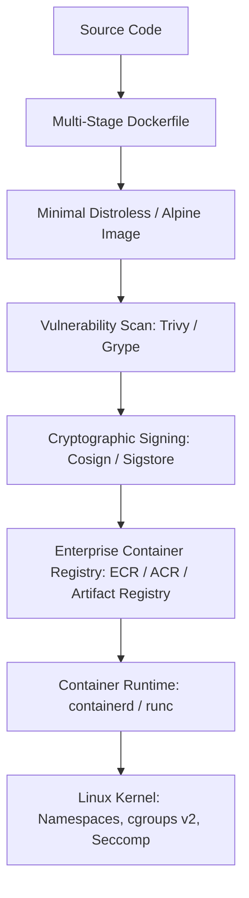

# Container Architecture: Enterprise Engineering & Security

## Executive Summary

Containers are the universal packaging format for modern enterprise software. Building production-grade container systems requires mastering **OCI image specifications**, **multi-stage optimization**, **supply-chain security**, and **kernel-level resource constraints**.

---

## Container Architecture Ecosystem

---

## Deliverables & Guides

| Document | Focus Area | Architectural Impact |
| :--- | :--- | :--- |
| **[Docker Architecture](docker-architecture.md)** | Engine internals | Docker daemon, containerd, runc, namespaces, cgroups |
| **[Image Architecture](image-architecture.md)** | Image optimization | Multi-stage builds, layer caching, distroless base images |
| **[Container Registries](container-registries.md)** | Enterprise registry design | Geo-replication, image immutability, vulnerability scanning |
| **[Container Security](container-security.md)** | Hardening & runtime security | Rootless execution, Seccomp profiles, dropping Linux capabilities |
| **[Container Networking](container-networking.md)** | Network modes | Bridge, host, overlay, macvlan, port mapping mechanics |
| **[Container Storage](container-storage.md)** | Storage mechanics | Ephemeral writable layers, bind mounts, named volumes, CSI |
| **[Container Lifecycle](container-lifecycle.md)** | Init & termination | PID 1 init processes, zombie reaping, graceful SIGTERM handling |
| **[Resource Limits](resource-limits.md)** | Kernel enforcement | cgroups v1 vs v2, CFS bandwidth quotas, memory OOM killer |
| **[Health Checks](health-checks.md)** | Readiness & liveness | Health check design, timeout intervals, cascading restarts |
| **[Supply Chain Security](supply-chain-security.md)** | Software provenance | SBOM (SPDX/CycloneDX), Cosign signing, SLSA Level 3 compliance |
| **[Immutable Infrastructure](immutable-infrastructure.md)** | Immutability patterns | Read-only root filesystems, ephemeral containers |
| **[Deployment Strategies](deployment-strategies.md)** | Release patterns | Recreate, Rolling Update, Blue/Green, Canary releases |
