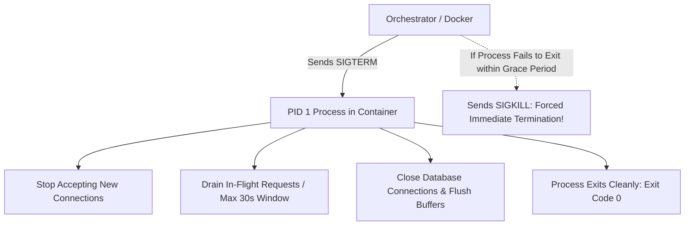

# Container Lifecycle, PID 1 & Graceful Shutdown

## Executive Summary

Understanding the container lifecycle—from initialization to termination—is essential for achieving zero-downtime deployments.

---

## 1. Graceful Shutdown Flow

---

## 2. The PID 1 Problem & Zombie Process Reaping

In Linux, Process ID 1 (PID 1) is the `init` system. It is uniquely responsible for:
1. **Adopting Orphaned Child Processes**: When a parent process dies before its child, the child is adopted by PID 1.
2. **Reaping Zombie Processes**: When a child process terminates, it remains a "zombie" until its parent calls `waitpid()`. If PID 1 does not implement zombie reaping, zombie processes accumulate until the Linux kernel PID table is completely exhausted, crashing the entire physical host.

> **Rule: Avoid Shell Wrapping**: Never run your application entrypoint via a shell wrapper (`ENTRYPOINT ["sh", "-c", "my-app"]`). The shell becomes PID 1, ignores `SIGTERM` signals from Docker/Kubernetes, and causes applications to hang until forced `SIGKILL` termination. Use exec form (`ENTRYPOINT ["/my-app"]`) or lightweight init systems like **tini** (`ENTRYPOINT ["/sbin/tini", "--", "/my-app"]`).
