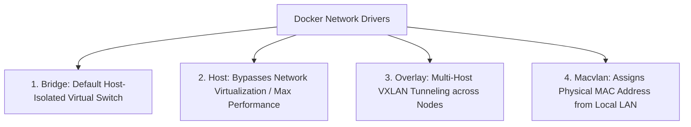

# Container Networking Architecture

## Executive Summary

Container networking enables communication between containers on the same host, across distributed cluster nodes, and to external cloud networks.

---

## 1. Docker Network Drivers

| Network Mode | Isolation Level | Port Allocation | Performance Profile |
| :--- | :--- | :--- | :--- |
| **Bridge (`bridge`)** | High (Veth pair + `docker0` bridge + iptables NAT) | Requires port mapping (`-p 8080:80`) | Moderate overhead due to netfilter/iptables NAT |
| **Host (`host`)** | None (Shares host network namespace directly) | Native host ports (Port collisions possible) | **Maximum throughput; zero NAT overhead** |
| **Overlay (`overlay`)**| Isolated multi-host network via VXLAN | Dynamic routing across Swarm/K8s nodes | Encapsulation overhead ($50\text{ bytes}$ per packet) |
| **Macvlan** | Direct connection to physical router LAN | Consumes dedicated IP on physical enterprise network | High performance; complex network switch MAC tables |
