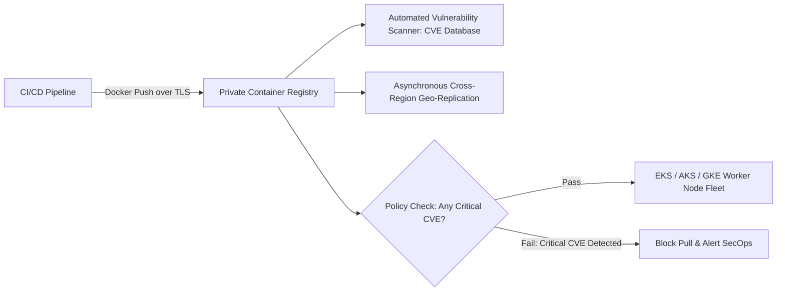

# Enterprise Container Registry Architecture

## Executive Summary

An Enterprise Container Registry (AWS ECR, Azure ACR, Google Artifact Registry, Harbor) is the central software repository for container images and Helm charts.

---

## 1. Registry Architecture & Security Topology

---

## 2. Core Enterprise Registry Standards

1. **Tag Immutability**:
   - Enforce **Immutable Image Tags** across all production registries. Overwriting existing tags (e.g., pushing a new build to `v1.2.0` or `:latest`) makes rollbacks non-deterministic and invalidates software auditability. Every container build must receive a unique immutable tag (e.g., git commit SHA).
2. **Automated Vulnerability Scanning on Push**:
   - Configure continuous vulnerability scanning. Block deployment pipelines automatically if a container image contains unresolved `CRITICAL` or `HIGH` CVEs.
3. **Cross-Region Replication**:
   - Geo-replicate registries across all active deployment regions. Kubernetes nodes pulling images from a distant cloud region face severe startup delays and incur high cross-region data transfer fees.
