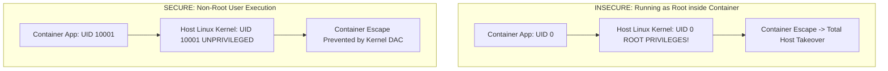

# Container Security: Hardening, Rootless & Capabilities

## Executive Summary

Containers share the host Linux kernel. A compromised root container process can exploit kernel vulnerabilities to achieve **container escape**, gaining full control of the underlying physical host.

---

## 1. The Principle of Rootless Execution



### Mandatory Hardening Rules
1. **Never Run as Root**: Always declare `USER 10001:10001` or `USER nonroot` in Dockerfiles and enforce `runAsNonRoot: true` in Kubernetes security contexts.
2. **Drop All Capabilities**: Linux divides root privileges into fine-grained units (capabilities). Drop all default capabilities and re-add only what is strictly required:
   ```yaml
   securityContext:
     allowPrivilegeEscalation: false
     readOnlyRootFilesystem: true
     capabilities:
       drop:
         - ALL
       add:
         - NET_BIND_SERVICE
   ```
3. **Read-Only Root Filesystem**: Mount the container root filesystem as `readOnlyRootFilesystem: true`. Force all temporary file writing to explicitly mounted ephemeral `emptyDir` volumes. Attackers cannot download or write malware binaries to a read-only filesystem.
