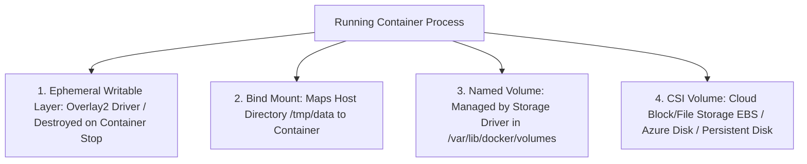

# Container Storage Architecture: Ephemeral Layers & Volumes

## Executive Summary

Containers are designed to be ephemeral. Data written to the container's default writable layer is lost when the container is destroyed. Managing state requires externalized storage volumes.

---

## 1. Storage Drivers & Volume Types

---

## 2. Overlay2 Storage Driver Mechanics

- **Copy-on-Write (CoW)**: When a container modifies an existing file from an underlying image layer, the storage driver copies the file up to the container's thin writable layer before applying changes.
- **Architectural Consequence**: Heavy random disk I/O (e.g., database writes) on an Overlay2 CoW filesystem incurs severe performance degradation. **All database data files, transaction logs, and high-throughput logging sinks must be mounted to dedicated block storage volumes (EBS/Disk), completely bypassing the storage driver.**
