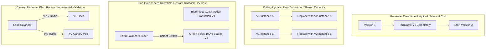

# Container Deployment Strategies

## Executive Summary

Selecting a container deployment strategy balances **downtime tolerance**, **resource cost**, and **blast radius risk**.

---

## 1. Deployment Strategies Comparison

---

## 2. Comparative Decision Matrix

| Strategy | Downtime | Infrastructure Cost Multiplier | Rollback Speed | Backward Compatibility Requirement |
| :--- | :---: | :---: | :---: | :---: |
| **Recreate** | Yes ($1 - 5\text{ mins}$) | $1.0\times$ | Slow (Re-pull and restart) | Not required |
| **Rolling Update** | Zero | $1.25\times$ (maxSurge) | Moderate (Roll back pods sequentially) | **Mandatory** (V1 and V2 run concurrently) |
| **Blue/Green** | Zero | $2.0\times$ (Double capacity during deployment) | **Instantaneous** (Switch load balancer target) | **Mandatory** (Shared database during swap) |
| **Canary** | Zero | $1.1\times$ | Fast (Route traffic away from canary) | **Mandatory** |
