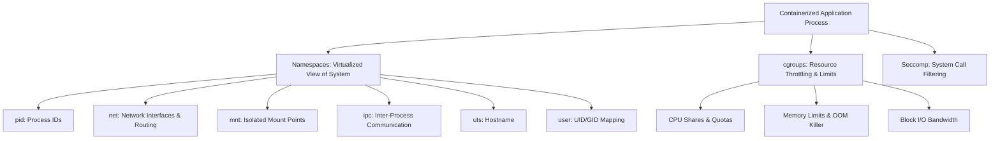

# Docker Architecture & Containerization Primitives

## Executive Summary

Containers are not lightweight virtual machines. A container is simply a standard Linux process running with restricted visibility (via **Namespaces**) and restricted resource consumption (via **Control Groups - cgroups**).

---

## 1. Linux Kernel Primitives

---

## 2. Docker Daemon vs Containerd Evolution

- **Docker Classic (Monolithic)**: A single massive `dockerd` root daemon managed the CLI, API, image builds, volume drivers, and container lifecycles. If `dockerd` crashed, all running containers died.
- **Modern Modular Architecture**:
  - `dockerd`: Thin developer CLI and API.
  - `containerd`: CNCF graduated core runtime managing image distribution and lifecycle.
  - `containerd-shim`: Decoupled lightweight process per container. Allows the main daemon to be restarted or upgraded **without restarting running customer containers**.
