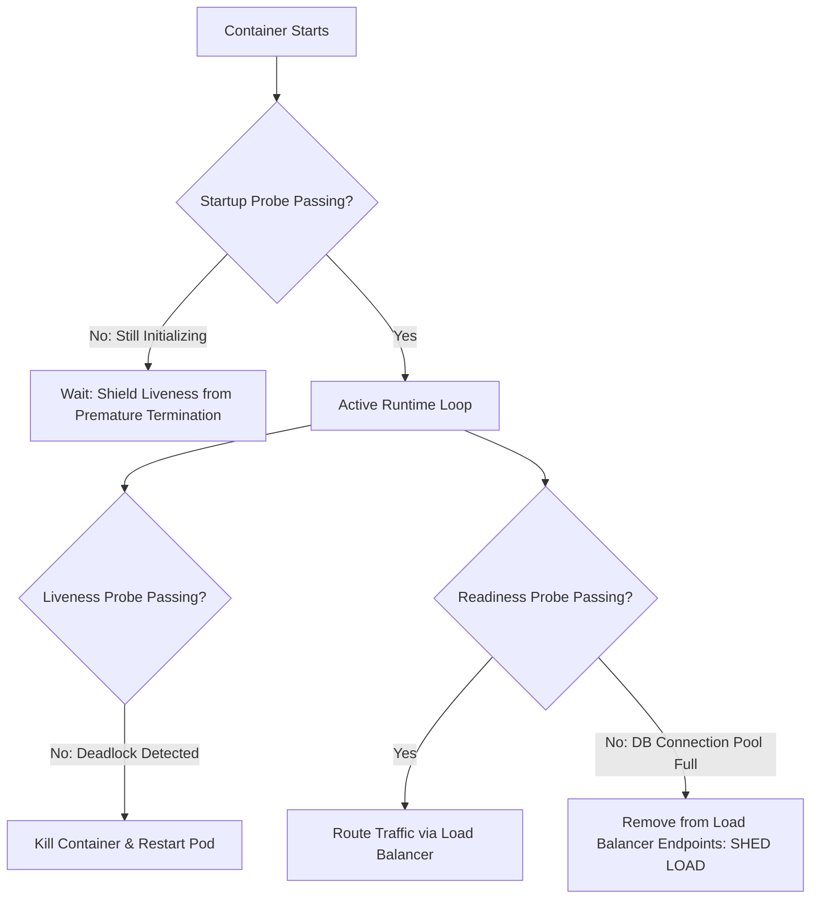

# Container Health Checks: Liveness, Readiness & Startup Probes

## Executive Summary

Health checks allow orchestrators to determine whether a container is healthy, ready to receive client traffic, or needs to be terminated and restarted.

---

## 1. The Three Health Probe Primitives

---

## 2. Health Check Design Guardrails

1. **Do Not Check Downstream Dependencies in Liveness Probes**:
   - If Service A's `/healthz` liveness probe executes a query against a shared PostgreSQL database, a database outage causes all instances of Service A to fail their liveness probes simultaneously. Kubernetes will kill and restart every container in a cascading reboot loop, exacerbating the outage.
   - **Liveness probes must check ONLY local process health** (e.g., internal event loop is responding, not deadlocked).
2. **Use Readiness Probes for Dependency Health**:
   - If downstream dependencies are unavailable, fail the **Readiness Probe**. This removes the container from load balancer endpoints, shedding client traffic while allowing the container to remain running and reconnect when the database recovers.
