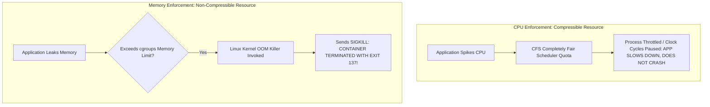

# Container Resource Limits: cgroups v2, CPU Throttling & OOM

## Executive Summary

Without explicit resource limits, a single misbehaved container (memory leak, infinite loop) will starve all adjacent containers sharing the host, causing host-wide crashes.

---

## 1. CPU Quotas vs Memory Limits

---

## 2. cgroups v1 vs cgroups v2

Modern Linux enterprise distributions standardise on **cgroups v2**:
- **Single Unified Hierarchy**: Eliminates conflicting resource controllers present in cgroups v1.
- **Enhanced OOM Control**: Allows orchestrators to kill the entire container cgroup atomically rather than killing a random sub-process.
- **Memory Pressure Stalling Information (PSI)**: Provides kernel metrics indicating memory starvation before the OOM killer triggers.
