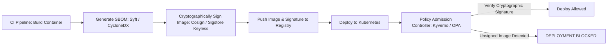

# Container Supply-Chain Security & Provenance

## Executive Summary

Modern cyberattacks increasingly target the software supply chain (e.g., injecting malicious dependencies into open-source packages). Securing enterprise containers requires generating **Software Bill of Materials (SBOM)**, **cryptographic image signing**, and enforcing admission policies.

---

## 1. Supply-Chain Verification Pipeline

---

## 2. SLSA Framework & Cryptographic Verification

- **SLSA (Supply-chain Levels for Software Artifacts)**: Target **SLSA Level 3** for enterprise systems, guaranteeing that build pipelines execute on isolated, ephemeral build platforms with cryptographically verifiable provenance attestations.
- **Cosign Keyless Signing**: Uses OpenID Connect (OIDC) identities from GitHub Actions or GitLab to obtain short-lived signing certificates from Fulcio and log signatures to the public immutable Rekor transparency ledger, eliminating private key management.
