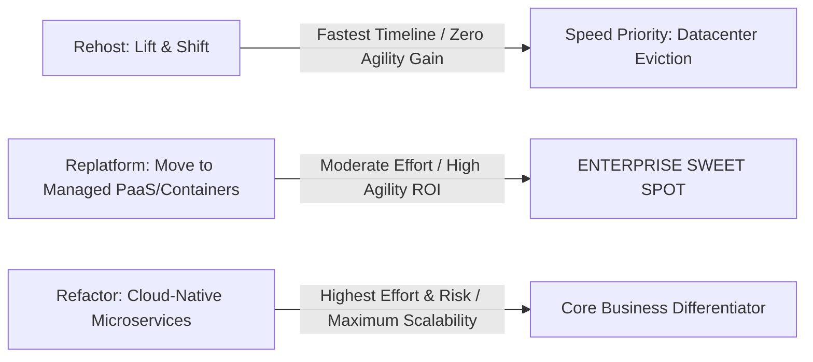

# Decision Framework: Rehost vs Replatform vs Refactor

```yaml
status: approved
decision_type: framework
scope: enterprise-modernization
owners: architecture-review-board
review_cadence: semi-annual
```

## 1. Modernization Trade-Off Matrix


