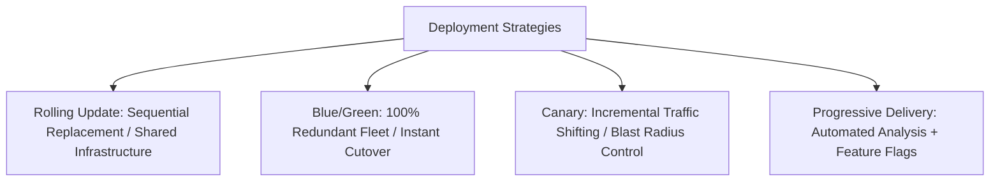

# Zero-Downtime Deployment Architecture

## Executive Summary

Zero-downtime deployment architectures decouple software releases from business service availability, ensuring deployments can occur continuously during peak business hours without maintenance windows.

---

## Deployment Paradigms

---

## Deliverables & Guides

| Document | Focus Area | Architectural Impact |
| :--- | :--- | :--- |
| **[Zero-Downtime Deployment](zero-downtime-deployment.md)** | Release strategies | Rolling, Blue/Green, Canary, Progressive Delivery |
| **[Database Schema Migrations](database-schema-migrations.md)**| Stateful zero-downtime | Expand-Contract / Parallel-Run pattern for database refactoring |
| **[Deployment Decision Framework](deployment-strategy-decision-framework.md)**| Measurable decision matrix | Quantitative scorecard selecting release strategy by workload |
