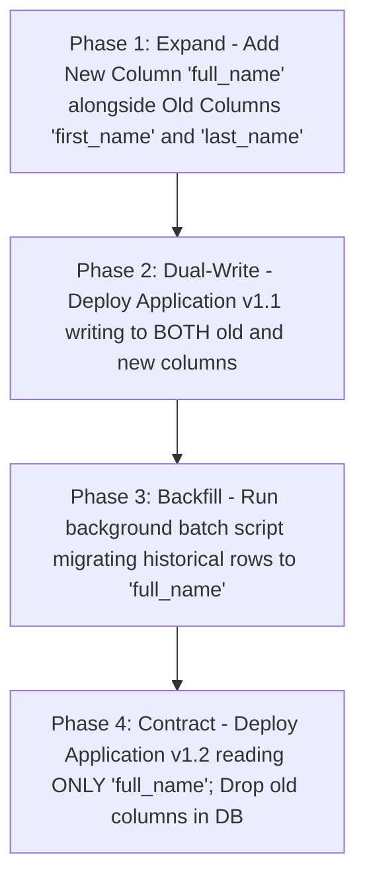

# Zero-Downtime Database Schema Migrations: The Expand-Contract Pattern

## Executive Summary

While compute instances can be swapped instantly, database schemas cannot. Dropping or renaming a column while old code is running crashes the application. Zero-downtime database changes require the **Expand-Contract (Parallel-Run) Pattern**.

---

## 1. The Expand-Contract Four-Phase Migration

---

## 2. Invariant Database Deployment Rules
1. **Never Execute Destructive DDL Simultaneously with Code**: Never drop tables or columns in the same release that updates application queries.
2. **All Schema Migrations Must Be Backward-Compatible**: The database schema must always support the previous version of application code ($N-1$) to allow instantaneous compute rollbacks without database surgery.
