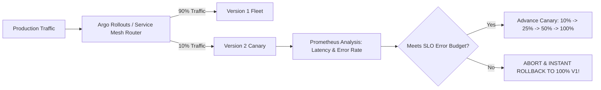

# Zero-Downtime Deployment Strategies: Rolling, Blue/Green & Canary

## Executive Summary

Selecting a deployment strategy balances **infrastructure cost**, **rollback speed**, and **backward compatibility**.

---

## 1. Progressive Canary Delivery Architecture

---

## 2. Strategy Trade-Offs

- **Rolling Updates**: Zero additional infrastructure cost, but rollbacks are slow and transient version mismatches (V1 and V2 running simultaneously) are guaranteed.
- **Blue/Green Deployments**: Instantaneous rollback (switch load balancer target), but requires doubling infrastructure capacity during deployment.
- **Canary Deployments**: Minimum blast radius; automated statistical validation prevents catastrophic regressions from reaching the broader customer base.
