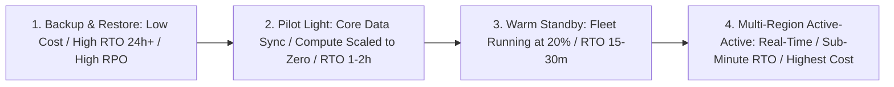

# Disaster Recovery (DR) Architecture

## Executive Summary

Disaster Recovery defines the strategies, architectures, and automated runbooks required to restore business operations following a catastrophic failure of a primary cloud datacenter or region.

---

## Disaster Recovery Spectrum

---

## Deliverables & Guides

| Document | Focus Area | Architectural Impact |
| :--- | :--- | :--- |
| **[RTO & RPO Engineering](rto-and-rpo-engineering.md)** | Metrics & modeling | RTO, RPO, MTTR, MTTD, calculating business outage cost |
| **[Backup & Restore](backup-and-restore.md)** | Traditional DR | Cold backup tiering, cross-region replication, testing restores |
| **[Pilot Light Strategy](pilot-light-strategy.md)** | Core data sync | Active database replica, compute scaled to zero, automated bootstrap |
| **[Warm Standby Strategy](warm-standby-strategy.md)** | Scaled-down secondary | Minimum running fleet, automated autoscaling failover triggers |
| **[Active-Active Multi-Region DR](active-active-multi-region-dr.md)**| Real-time multi-region | Bi-directional active-active, conflict resolution, cost realities |
| **[Cross-Cloud DR Patterns](cross-cloud-dr-patterns.md)** | Multi-provider DR | Cross-cloud replication, multi-cloud DNS cutover |
| **[DR Strategy Decision Matrix](dr-strategy-decision-matrix.md)**| Measurable decision matrix | The quantitative evaluation matrix across all 4 DR tiers |
| **[Automated Failover & Drills](automated-failover-and-dr-drills.md)**| Game days & testing | Automated failover runbooks, chaos testing, verifying recovery |
