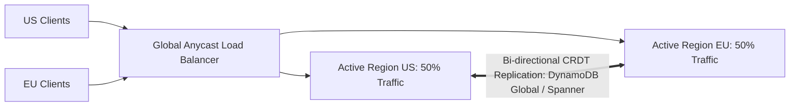

# Active-Active Multi-Region Disaster Recovery

## Executive Summary

Multi-region active-active architectures serve production traffic simultaneously from two or more regions worldwide, providing near-zero RTO.

---

## 1. Active-Active Architecture Topology

---

## 2. Architectural Constraints
- Requires multi-master distributed databases (Google Cloud Spanner, AWS DynamoDB Global Tables, CockroachDB) capable of handling concurrent conflicting writes.
- Cost index is $2.2\times - 2.5\times$ base single-region infrastructure.
