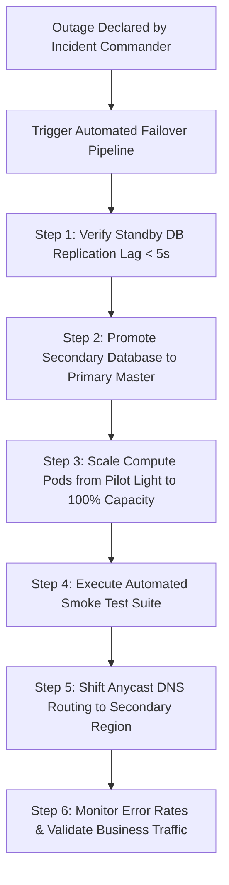

# Automated Failover Runbooks & Disaster Recovery Drills

## Executive Summary

A disaster recovery architecture is only as reliable as its last verified drill. Enterprise organizations must conduct regular, automated **Game Day Drills**.

---

## 1. Automated Failover Orchestration Workflow

---

## 2. DR Drill Governance Standards
- Conduct quarterly unannounced regional failover drills in staging environments.
- Conduct annual scheduled production failover drills during planned maintenance windows.
