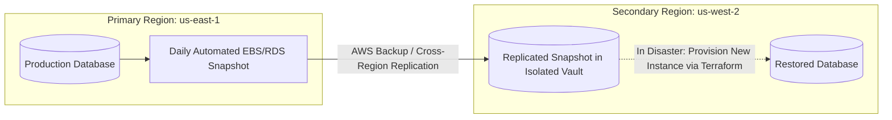

# Backup & Restore Disaster Recovery Strategy

## Executive Summary

Backup & Restore is the most cost-effective disaster recovery tier, suitable for non-critical back-office systems with high tolerance for downtime.

---

## 1. Architecture Flow

---

## 2. The Unverified Backup Anti-Pattern
> **A backup that has never been restored and verified is an unverified hypothesis.**

- Schedule automated monthly restore drills using an isolated pipeline: restore the latest snapshot into an ephemeral test account, execute automated integrity queries, and destroy the restored database upon verification.
