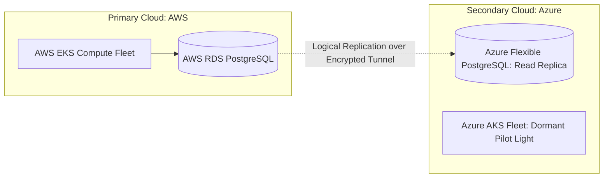

# Cross-Cloud Disaster Recovery Architecture

## Executive Summary

When regulatory compliance (e.g., EBA outsourcing guidelines) mandates disaster recovery outside the primary cloud provider, enterprises implement **Cross-Cloud DR**.

---

## 1. Cross-Cloud Asynchronous Replication

---

## 2. Operational Realities
- **Accept Asynchronous RPO**: Because cross-cloud networking introduces 15–40 ms latency, replication must remain asynchronous, accepting seconds of data loss during catastrophic cutover.
- **Independent Third-Party DNS**: Global routing must reside on an independent Anycast provider (Cloudflare, NS1) to prevent a primary cloud outage from taking down DNS routing.
