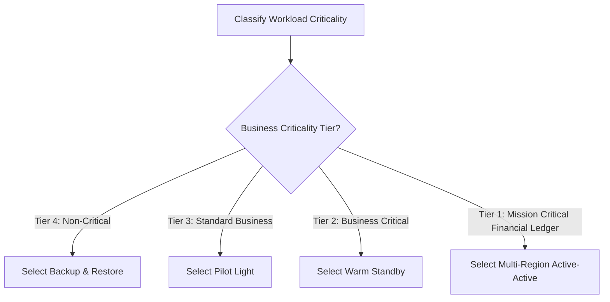

# Disaster Recovery Strategy Decision Matrix

```yaml
status: approved
decision_type: framework
scope: enterprise-disaster-recovery
owners: architecture-review-board
review_cadence: annual
```

## Executive Summary

This matrix provides the definitive comparative evaluation across all disaster recovery tiers, balancing financial investment against downtime tolerance.

---

## 1. Comparative Strategy Matrix

| DR Strategy | Target RTO | Target RPO | Infrastructure Cost Multiplier | Operational Complexity | Target Enterprise Workload |
| :--- | :---: | :---: | :---: | :---: | :--- |
| **Backup & Restore** | 12–24 Hours | 12–24 Hours | **$1.05\times$** | **Low** | Internal reporting, dev/test, non-critical back-office |
| **Pilot Light** | 30–60 Mins | $< 1\text{ Minute}$ | **$1.25\times$** | **Moderate** | Standard enterprise core applications, ERP, CRM |
| **Warm Standby** | 5–15 Mins | $< 1\text{ Second}$ | **$1.60\times$** | **High** | Business-critical SaaS, consumer checkout, trading APIs |
| **Multi-Region Active-Active**| Near-Zero ($< 1\text{m}$)| Near-Zero | **$2.30\times$** | **Extreme** | Tier-1 Core Banking, high-frequency clearing systems |

---

## 2. Strategy Selection Flowchart


