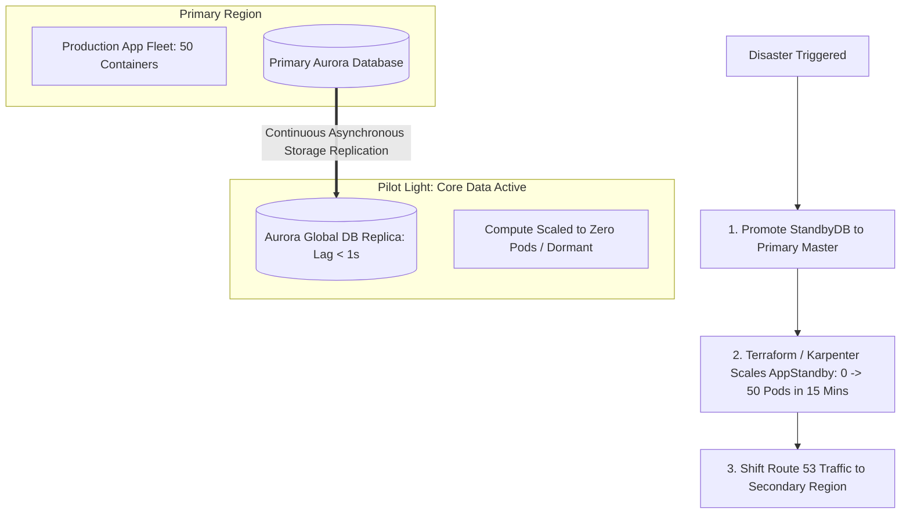

# Pilot Light Disaster Recovery Strategy

## Executive Summary

In a **Pilot Light** architecture, the core data tier is continuously replicated to a secondary region in real time, while the compute tier (containers, virtual machines) is kept dormant or scaled to zero.

---

## 1. Pilot Light Architecture Blueprint

---

## 2. Performance Profile
- **RTO**: 30 to 60 minutes (time required to scale up container clusters and warm caches).
- **RPO**: Sub-second (continuous asynchronous storage replication).
- **Cost**: Moderate ($1.2\times - 1.3\times$ of primary infrastructure spend).
