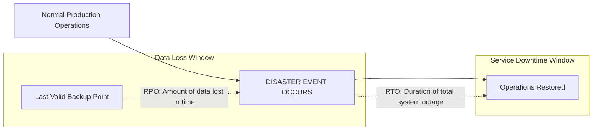

# RTO & RPO Engineering: Financial Modeling & Outage Metrics

## Executive Summary

Disaster recovery requirements must be grounded in empirical financial metrics: **Recovery Time Objective (RTO)** and **Recovery Point Objective (RPO)**.

---

## 1. RTO vs RPO Illustrated

---

## 2. Financial Cost-Benefit Formula for DR

$$\text{Total DR Cost} = \text{Infrastructure Cost of DR Tier} + (\text{Probability of Disaster} \times \text{Financial Loss per Outage Hour} \times \text{RTO})$$

- If an enterprise system incurs $\$50,000/\text{hour}$ during an outage, spending $\$1,000,000/\text{year}$ to reduce RTO from 1 hour to 1 minute is economically irrational.
- **Rule**: RTO and RPO targets must be formally signed off by business product owners via Architecture Decision Records (ADRs).
