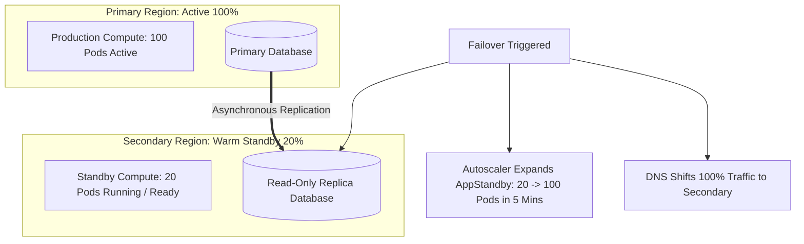

# Warm Standby Disaster Recovery Strategy

## Executive Summary

**Warm Standby** maintains a scaled-down, fully functional mirror of the production environment running 24/7 in a secondary region.

---

## 1. Warm Standby Architecture Blueprint

---

## 2. Performance Profile
- **RTO**: 5 to 15 minutes (scaled-down instances immediately serve initial traffic while autoscaling kicks in).
- **RPO**: Sub-second.
- **Cost**: High ($1.5\times - 1.7\times$ of primary infrastructure spend).
