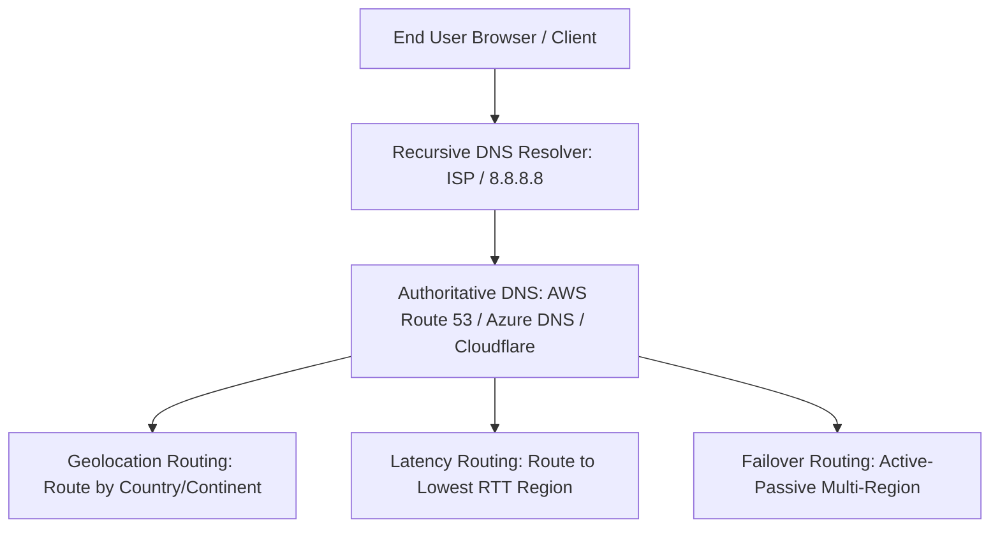

# Enterprise Cloud DNS Architecture

## Executive Summary

The Domain Name System (DNS) is the global directory service of the internet. In enterprise cloud architecture, DNS provides **global traffic steering**, **latency-based routing**, **split-horizon network isolation**, and **automated multi-region failover**.

---

## DNS Routing Hierarchy

---

## Deliverables & Guides

| Document | Focus Area | Architectural Impact |
| :--- | :--- | :--- |
| **[DNS Fundamentals](dns-fundamentals.md)** | Authoritative vs Recursive | DNS hierarchy, query lifecycles, record types (A, CNAME, ALIAS) |
| **[Routing Policies](routing-policies.md)** | Traffic steering | Geolocation, Geoproximity, Latency, Weighted, Failover policies |
| **[DNS Failover & Health Checks](dns-failover-and-health.md)**| Automated DR routing | Synthetic health checks, TTL caching dynamics, avoiding flapping |
| **[Private DNS & Split-Horizon](private-dns-and-split-horizon.md)**| Internal network isolation | Private Hosted Zones, cross-account resolution, hybrid forwarding |
| **[Multi-Cloud & Hybrid DNS](multi-cloud-and-hybrid-dns.md)**| Cross-environment DNS | Route 53 Resolver endpoints, Azure Private Resolvers, BIND forwarding |
