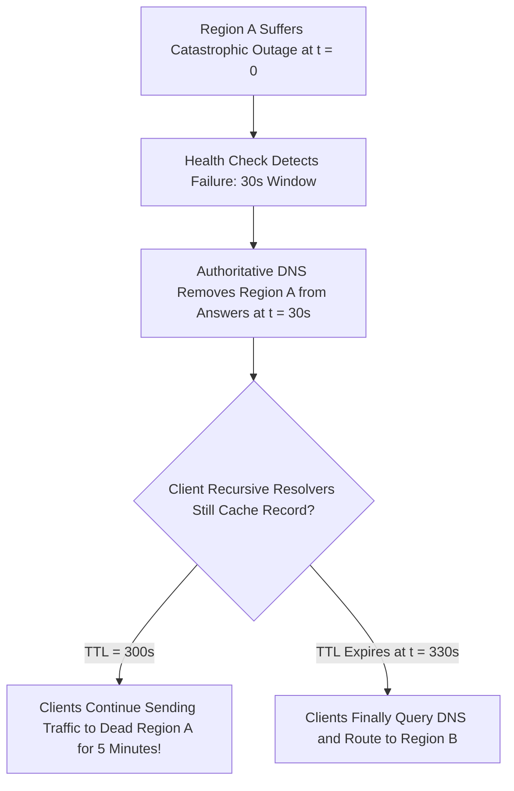

# DNS Failover Architecture & TTL Caching Dynamics

## Executive Summary

DNS-based failover uses synthetic health checks to detect regional outages and remove unhealthy endpoints from DNS responses. However, **DNS failover is fundamentally bound by TTL caching**.

---

## 1. The Reality of DNS Failover Latency

---

## 2. Architectural Guardrails for DNS Failover

1. **Tune TTLs for Failover Endpoints**:
   - For endpoints configured for automated disaster recovery failover, set DNS **TTL to 60 seconds**.
   - Setting TTL to 0 is prohibited because many corporate and ISP recursive resolvers ignore sub-minute TTLs and cache for a minimum of 300 seconds regardless.
2. **Health Check Invert & Flapping Suppression**:
   - Configure health checks with high healthy thresholds (e.g., 5 consecutive passes) to prevent **DNS flapping** (where a flapping server repeatedly enters and exits rotation, destabilizing client caches).
