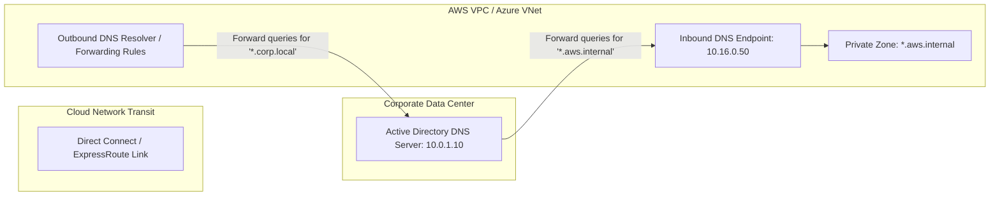

# Hybrid & Multi-Cloud DNS Resolution Architecture

## Executive Summary

Connecting on-premises Active Directory DNS with cloud-native private DNS zones requires bidirectional forwarding to resolve hostnames seamlessly across hybrid links.

---

## 1. Bidirectional Hybrid DNS Forwarding Architecture

---

## 2. Resolution Mechanics

- **Inbound Endpoints**: Exposes a static private IP inside the cloud VPC that on-premises DNS servers can target with conditional forwarding rules.
- **Outbound Endpoints & Rules**: Inspects VPC DNS queries; if a query matches `*.corp.local`, it intercepts the query and forwards it across Direct Connect to the on-premises domain controllers.
