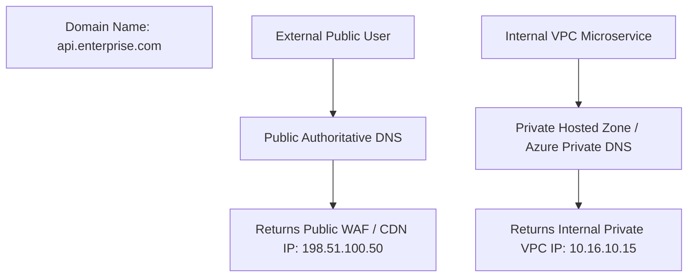

# Private DNS & Split-Horizon Architecture

## Executive Summary

**Split-Horizon DNS** allows an enterprise to maintain two completely separate views of the same domain name: a public view for external internet users and a private view for internal VPC workloads.

---

## 1. Split-Horizon DNS Resolution

---

## 2. Cross-Account Private Hosted Zone Sharing

In an enterprise multi-account landing zone:
- Manage core internal domains (e.g., `corp.internal`) in a dedicated **Shared Network Account**.
- Associate the Private Hosted Zone with all workload VPCs across hundreds of child accounts via AWS RAM (Resource Access Manager) or Azure Virtual Network Links.
- Workloads resolve internal microservice endpoints across VPCs privately without traversing the public internet.
