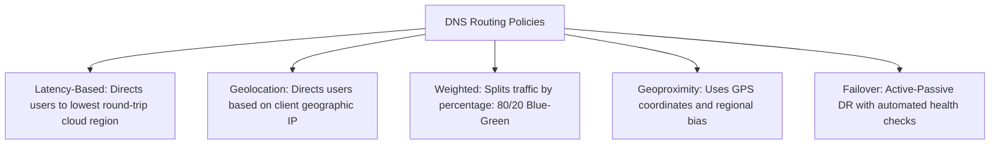

# Advanced DNS Routing Policies

## Executive Summary

Modern cloud authoritative DNS engines provide advanced routing policies to optimize user experience and regulatory compliance.

---

## 1. Routing Policy Comparison

---

## 2. Latency vs Geolocation Routing

- **Latency-Based Routing**: The cloud DNS provider maintains real-time latency maps between worldwide network networks and cloud data centers. A user in London is routed to `eu-west-1` (Dublin) if Frankfurt has network congestion, ensuring the lowest latency.
- **Geolocation Routing**: Routes strictly by physical geography (e.g., all European visitors routed to Frankfurt). **Mandatory for regulatory compliance (GDPR)** to ensure European citizen traffic is processed exclusively on European soil.
