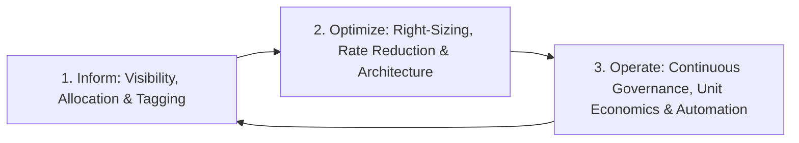

# FinOps Architecture & Cloud Financial Management

## Executive Summary

FinOps (Cloud Financial Operations) is the operational framework and cultural practice of maximizing business value in the cloud by enabling cross-functional collaboration between engineering, finance, and leadership.

---

## The FinOps Lifecycle

---

## Deliverables & Guides

| Document | Focus Area | Architectural Impact |
| :--- | :--- | :--- |
| **[FinOps Principles](finops-principles.md)** | Foundational principles | The FinOps Foundation lifecycle: Inform, Optimize, Operate |
| **[Cost Allocation & Showback](cost-allocation-and-showback.md)**| Financial visibility | Tagging hygiene, showback vs chargeback, shared cost distribution |
| **[Unit Economics](unit-economics.md)** | Business value metrics | Cost per transaction, cost per customer, cost per API request |
| **[FinOps Governance & Culture](finops-governance-and-culture.md)**| Governance & KPIs | Budget alerting, anomaly detection, executive financial scorecards |
