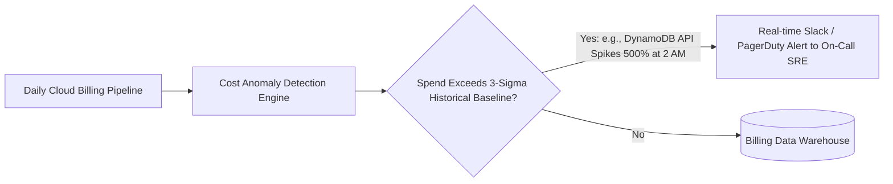

# FinOps Governance, KPIs & Anomaly Detection

## Executive Summary

Operationalizing FinOps requires automated cost anomaly detection, strict budget thresholds, and executive scorecards.

---

## 1. Machine-Learning Anomaly Detection

---

## 2. Key FinOps KPIs
1. **Unallocated Spend Percentage**: Target $< 5\%$ of total enterprise cloud bill unallocated to cost centers.
2. **Commitment Coverage**: Target $> 75\%$ of steady-state compute covered by Savings Plans or Reserved Instances.
3. **Commitment Utilization**: Target $> 95\%$ utilization of purchased discount commitments.
